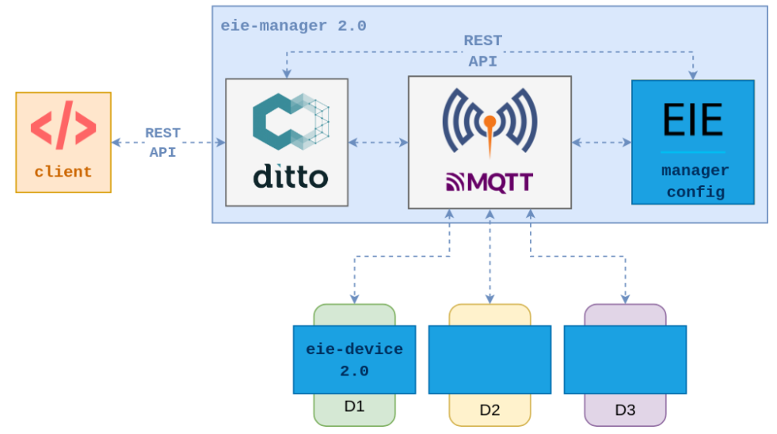
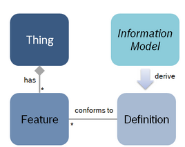

*************
Proyecto Final: EieManager 2:0
*************

Integrantes
=======
 - Katharina Alfaro Solís **B80251**
 - Robin Gonzalez **B43011**
 - German Ureña Araya **B77809**

Documentación:
==================

El departamento de R&D aprobó el presupuesto para el desarrollo del prototipo de ``eieManager 2.0``, de tal forma que se debe incorporar los aprendizajes del primer prototipo realizado de ``eieManager`` e incorporar una nueva arquitectura que permita despliegues de gran escala, tal como es propuesta y querida por los ejecutivos de la empresa. 

Para la nueva arquitectura propuesta se debe integrar **Eclipse Ditto** y **Eclipse Mosquitto** para la comunicación con los dispositivos mediante ``MQTT``. Se debe implementar los componentes nuevos: eie-manager-config y eie-device 2.0. Tal como se muestran en el siguiente diagrama (obtenido de la `documentación <https://ie0417.readthedocs.io/es/latest/projects/final/final.html#>`_ oficial del proyecto del curso):

**eie-manager-config:**
---------------------

Consiste en un microservicio de Python que tiene como propósito principal facilitar la configuración y el despliegue del sistema, de forma que se considera la mantenibilidad del mismo. Para crear este se deben configurar las conexiones de MQTT y los dispositivos de Ditto. Se debe implementar el feature Device Discovery en este componente del sistema. 

``Device descovery``:  Busca facilitar el mantenimiento del sistema ya que permite que los dispositivos se descubran automáticamente al publicar su configuración a ``eie-manager-config``. Se utiliza la información obtenida de cada device para generar un identificador único de los dispositivos y este se registra en la instancia Ditto. Además, se utilizará una secuencia tipo handshake para comunicar los dispositivos con eie-manager-config. Para realizar lo anterior, se utilizan los mismos topics de MQTT para todos los dispositivos: ``eie-manager/config/device_discovery/response`` y ``eie-manager/config/device_discovery/request``.

**eie-device:**
----------------

Se basa en una biblioteca en C que facilita la integración de los dispositivos con el sistema. La idea es que la biblioteca sea capaz de abstraer los detalles del ``Ditto protocol`` y del cliente de ``MQTT``, de manera que se represente la funcionalidad del dispositivo.

Se debe soportar una estructura de ``Thing`` como la que se muestra en la siguiente imagen, que representa features con propiedades estándar de configuración y status. `One thing can have many features. A feature may conform to a definition.` Se utilizará `Vorto function block` que consite en diferentes secciones que definen estados y capacidades de un dispositivo. Las secciones de configuración, estado y fallo de un bloque de funciones definen el estado de una función en Ditto, estas están asiganadas a un objeto JSON. 

`Obtenido de: https://www.eclipse.org/ditto/basic-feature.html#mapping-vorto-function-block-elements`

Además se debe soportar la recepción de mensajes de Ditto para actualizar el dispositivo real mediante MQTT. Para esto se deben soportar callbacks para atender los eventos que son generados al modificar la propiedad configuration (read-write) en un feature del Twin desde el REST API, por ejemplo.

También debe soportar el envío de mensajes a Ditto para actualizar el Twin del dispositivo mediante ``MQTT``. Este debe soportar la publicación de comandos que actualizan la propiedad status(read-only)en un feature del Twin.

De igual manera para este componente se debe implementar el feature de ``Device Discovery``.

Justificación
=============

En la sección anterior se mencionó y explicó a grandes rasgos y en manera sintetizada la nueva arquitectura propuesta con los componentes de esta. Si analizamos los problemas de la solución actual, uno de ellos es que los RPCs no se ajustan bien a la necesidad de comunicar eventos de manera asincrónica desde los dispositivos, ya que se quiere que al haber un cambio de estado o alarma en un dispositivo se pueda saber sin que el sistema lo solicite. El patrón de Broker aporta mayor flexibilidad al mantenimiento y al cambio, pero a la vez si un dispositivo o componente ocupa un servicio de otro que se ubica en donde no se conoce, el broker se encarga de esa conexión entre componentes, de manera que el broker ofrece la solución al problema mencionado donde no debe existir la solicitud del sistema para que la comunicación entre cliente y dispositivo exista.

Otro problema señalado es que no se incluía el concepto de niveles de autorización para el acceso a grupos de dispositivos, esto se soluciona en esta nueva arquitectura al incrementar la seguridad del sistema con el nuevo componente ``eie-manager-config`` en el cual existen políticas de acceso y conexiones de `source` y `target` al broker de ``MQTT`` lo cual hace que el acceso a los dispositivos sea autenticado y restringido. Estas configuraciones se pueden obtener de archivos de configuración de JSON y luego registrarlas con el REST API de Ditto.

Por último, se menciona que el mantenimiento del sistema es complejo, debido a que un operador debe registrar manualmente cada dispositivo que se instale en la fábrica. Con la implementación de ``Device Discovery`` se busca facilitar el mantenimiento del sistema ya que la idea es permitir que los dispositivos se descubran automáticamente al publicar su configuración a eie-manager-config, se genera un identificador único y se registra en Ditto, también se debe implementar la secuencia tipo handshake para comunicar a eie-device con eie-manager-config.  Podemos volver a mencionar el patrón de Broker en este punto, ya que también facilita el cambio y el agregar nuevos dispositivos o funciones. 

Requerimientos funcionales y no funcionales 
============

Requerimientos funcionales del eie-device
--------------------------
 - ``REQ-001``  Para la implementación de la biblioteca eie-device se utilizará un proyecto de Cmake, el Cmake construirá una biblioteca dinámica llamada eie-device.

 - ``REQ-002`` La biblioteca eie-device se comunicará con Mosquito empleando el cliente Paho MQTT C.

 - ``REQ-003`` Para facilitar la integración de los dispositivos con el sistema, eieDevice debe implementar una biblioteca en C, la cual debe abstraer los detalles de ditto protocol y del cliente MQTT.

 - ``REQ-004``  La biblioteca eie-device soporta el envio y recepción de mensajes a Ditto mediante MQTT para leer y actualizar el dispositivo según corresponda.     

 - ``REQ-005``   La biblioteca eie-device implementa un microservicio llamado Device Discovery que notifica la creación de un nuevo dispositivo con un identificador único para ser registrado en Ditto.

Requerimientos funcionales del eie-manager-config
--------------------------
 
 - ``REQ-006`` Debe implementarse un microservicio en python para facilitar la configuración y el despliegue del sistema. Por lo que se debe configurar políticas, las conexiones MQTT y los dispositivos en Ditto.

 - ``REQ-007`` El microservicio eie-manager-config obtiene de un archivo Json, las políticas de acceso entre dispositivos y el broker MQTT y luego las registra en el microservicio Ditto.

 - ``REQ-008`` El microservicio eie-manager-config implementa un handshake para comunicarse con la biblioteca eie-device mediante MQTT.

Diseño de API
============

Diagramas
============

Se implementaron los diagramas de secuencia sobre los siguientes escenarios de uso del sistema. 

1. El ``client`` modifica la propiedad ``configuration`` en un feature del `twin` de un dispositivo.

.. uml::

   @startuml

   actor Client as cli
   entity Ditto as ditt
   entity MQTT Broker as mqtt
   entity eie-device as dev

   cli -> ditt: Send command to request modify the "configuration" property of a device
   group eie-manager 2.0 
   ditt -> mqtt: Generate an event and routes the command to be sent to a topic in MQTT
   mqtt -> mqtt: Locates the required device and performs the modification on the device
   mqtt -> dev: Set the new configuration 
   dev -> dev: Update the configuration feature
   mqtt <- dev : Return OK response 
   ditt <- mqtt: Return OK response 
   end
   cli <- ditt: Return response to the client

   @enduml

2. El ``eie-device`` actualiza la propiedad ``status`` en un feature de su twin correspondiente publicando a un topic de MQTT.

3. El ``eie-device`` publica su configuración inicial y es registrado por ``eie-manager-config`` en DItto. 

