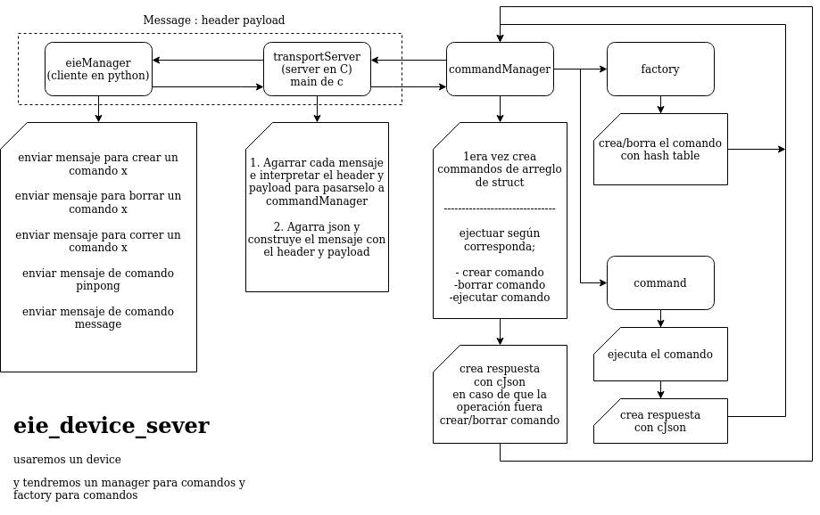

*************
Laboratorio 3
*************

Integrantes
=======
 - Katharina Alfaro Solís **B80251**
 - Robin Gonzalez **B43011**
 - German Ureña Araya **B77809**

Documentación 
==================

En este laboratorio se implementó el prototipo de ``eieDevice``, tal como se presentó en el problema de diseño del laboratorio 1. Realizamos el siguiente diagrama de guía para implementar eieDevice, tal como fue establecido en este laboratorio.

Podemos observar que el cliente, en este momento se implementa en eieManager y este le envía wl mensaje a eieDevice el cual se encarga de ejecutar el comando que viene en el mensaje del cliente para un dispositivo. EieDevice consiste en el transportServer quien interpreta el mensaje con el payload y el header de manera que este lo recibe commandManager quien tiene la posibilidad de borrar, crear o ejecutar el comando enviado y mandarlo al device segun sea el caso. 

Es importante mencionar que se implementa le servidos utilizando la librería ``ZMQ`` y para empaquetar los datos del servidor se utiliza la librería ``CJSON`` ya que se usa ``JSON``.

Comandos utilizados
-----------------------

* ``Message``: No recibe ningún parámetro y retorna un string con nombre "output" y con un mensaje arbitrario utilizando JSON.

* ``PingPong``:  Recibe una lista arbitraria de argumentos y retorna un JSON con la misma lista. 